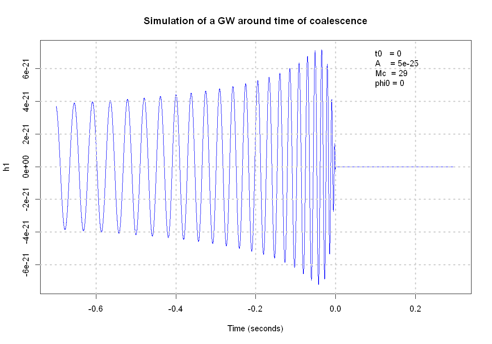
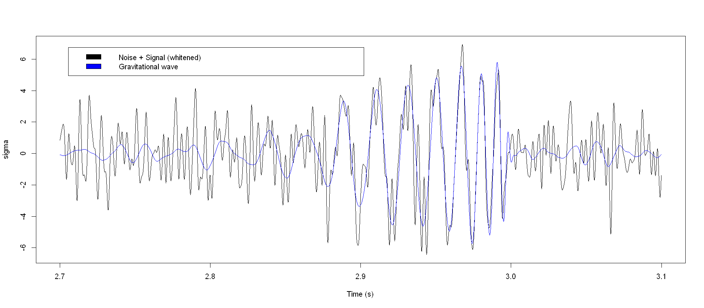
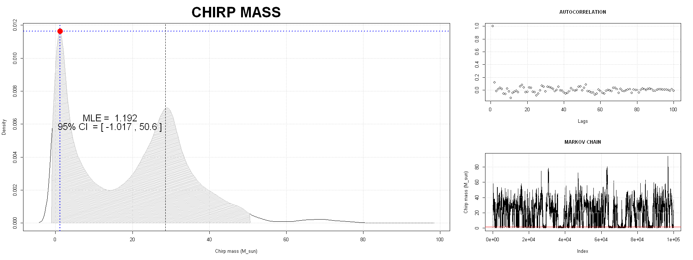
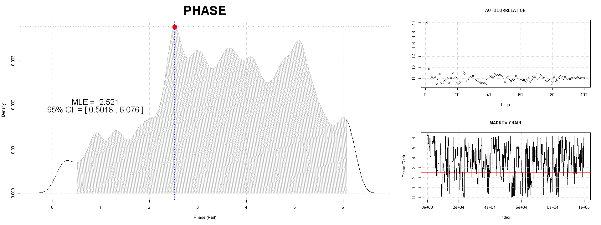

# Gravitational Waves bayesian Inference
***
The distortion that gravitational waves make when passing througth space is in the order of ~$ 10^{-21}$. In the interferometers build to measure these the effects amount to a difference in length in the arms of $10^{-18}$ m  over a span of 4 Km. 

Measuring these small changes over such a huge distance is the biggest challenge that gravitational wave astronomy has to face, since noise dominates the signal over all of the frequency spectrum

In this project we will face these same challanges that the LIGO-Virgo collaboration has to deal with, trying to mitigate the noise and study the signal, by trying to infere some of the parameters of the black hole.

The signals that we will try to find will be simulated by us and are not the real ones, since the real wave shape at coalescence is really complex and requires methods of numerical relativity to correctly evaluate. So we will add a simpler signal that bears the same characteristic of a real one to the actual noise recived by the interferometers.
